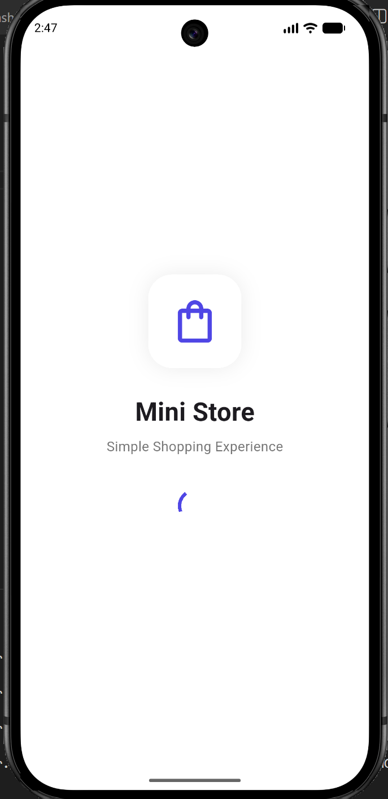
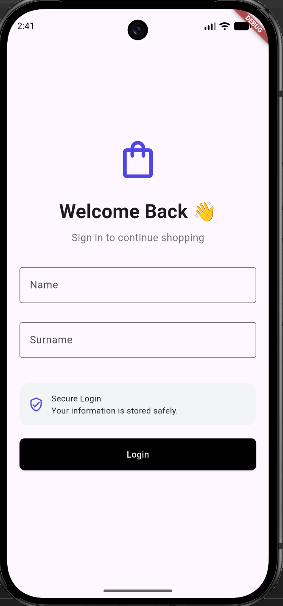
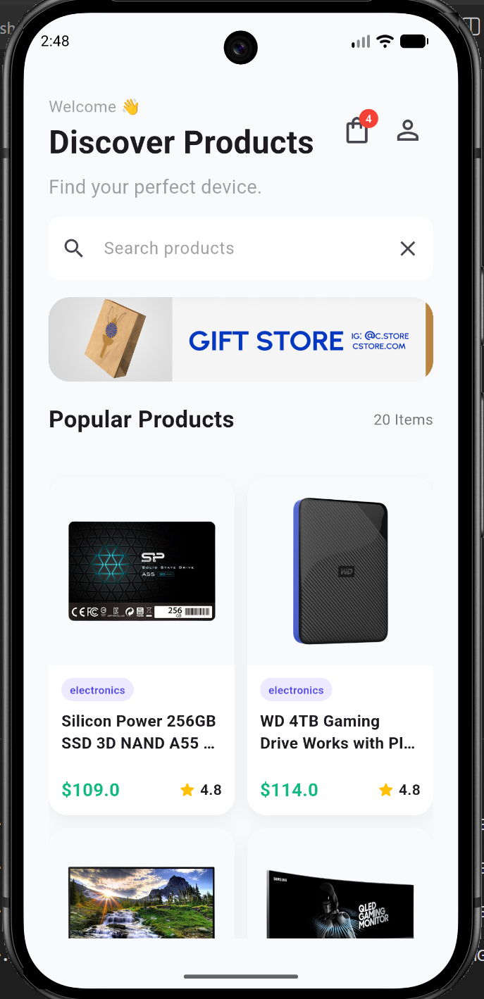
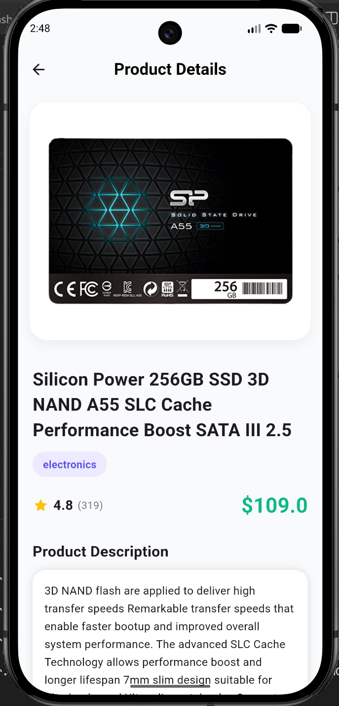
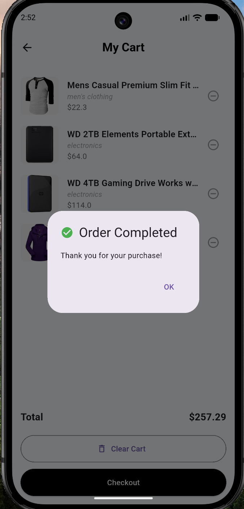

# 🛍️ Mini Store - Flutter Mobile Application

A simple e-commerce mobile application developed with **Flutter**. This project demonstrates the fundamentals of mobile application development, including authentication, REST API integration, local storage, navigation, reusable UI components, and shopping cart management.

---

## 📱 Features

### Authentication

* Splash Screen
* User Login
* Logout
* Persistent login using SharedPreferences

### Product Management

* Fetch products from REST API
* Product Grid View
* Product Search
* Product Detail Page

### Shopping Cart

* Add products to cart
* Remove products from cart
* Clear cart
* Cart badge displaying selected item count
* Checkout simulation

### User Interface

* Material Design
* Responsive Layout
* Reusable Widgets
* Clean UI

---

## 📸 Screenshots

| Splash | Login |
|--------|-------|
|  |  |

| Home | Cart |
|------|------|
|  |  |

| Order Completed |
|-----------------|
|  |

---

## 🏗 Project Structure

```text
lib/
│
├── components/
│   ├── mini_tile.dart
│   └── product_tile.dart
│
├── models/
│   └── product_model.dart
│
├── services/
│   ├── api_service.dart
│   └── local_storage.dart
│
├── views/
│   ├── splash_screen.dart
│   ├── login_screen.dart
│   ├── product_screen.dart
│   ├── product_detail_screen.dart
│   └── cart_screen.dart
│
├── screenshots/
│   ├── Splash.png
│   ├── Login.png
│   ├── Home.png
│   ├── Cart.png
│   └── Order_Completed.png
│
└── main.dart
```

---

## 🛠 Technologies Used

* Flutter
* Dart
* Material Design
* HTTP Package
* SharedPreferences
* Fake Store API

---

## 🌐 API

Product data is retrieved from the Fake Store API:

https://fakestoreapi.com/products

---

## 📦 Dependencies

```yaml
dependencies:
  flutter:
    sdk: flutter
  http: ^1.5.0
  shared_preferences: ^2.5.3
```

Install all dependencies:

```bash
flutter pub get
```

---

## 🚀 Getting Started

### 1. Clone the repository

```bash
git clone https://github.com/eneskacarr/mini-store-flutter.git
```

### 2. Navigate to the project folder

```bash
cd mini-store-flutter
```

### 3. Install dependencies

```bash
flutter pub get
```

### 4. Run the application

```bash
flutter run
```

---

## 📚 Flutter Concepts Demonstrated

* Stateful Widgets
* Stateless Widgets
* Navigation
* Route Arguments
* REST API Integration
* HTTP Requests
* JSON Parsing
* Model Classes
* SharedPreferences
* Local Storage
* Search & Filtering
* GridView
* ListView
* Reusable Components
* Basic State Management

---

## 🚀 Flutter Version

```text
Flutter 3.44.4 (Stable)
Dart 3.12.2
DevTools 2.57.0
```

---

## 🚧 Future Improvements

* User Registration
* Product Categories
* Favorites (Wishlist)
* Dark Mode
* Product Rating Filter
* Order History
* Firebase Authentication
* Online Payment Integration

---

## 🎯 Learning Outcomes

This project was developed to practice:

* Flutter UI development
* Widget composition
* Navigation between screens
* REST API consumption
* JSON serialization
* Local data persistence
* Search functionality
* Shopping cart logic
* Reusable component design
* Mobile application architecture

---

## 👨‍💻 Developer

**Enes Kacar**

Developed as part of a Flutter training program for educational purposes.